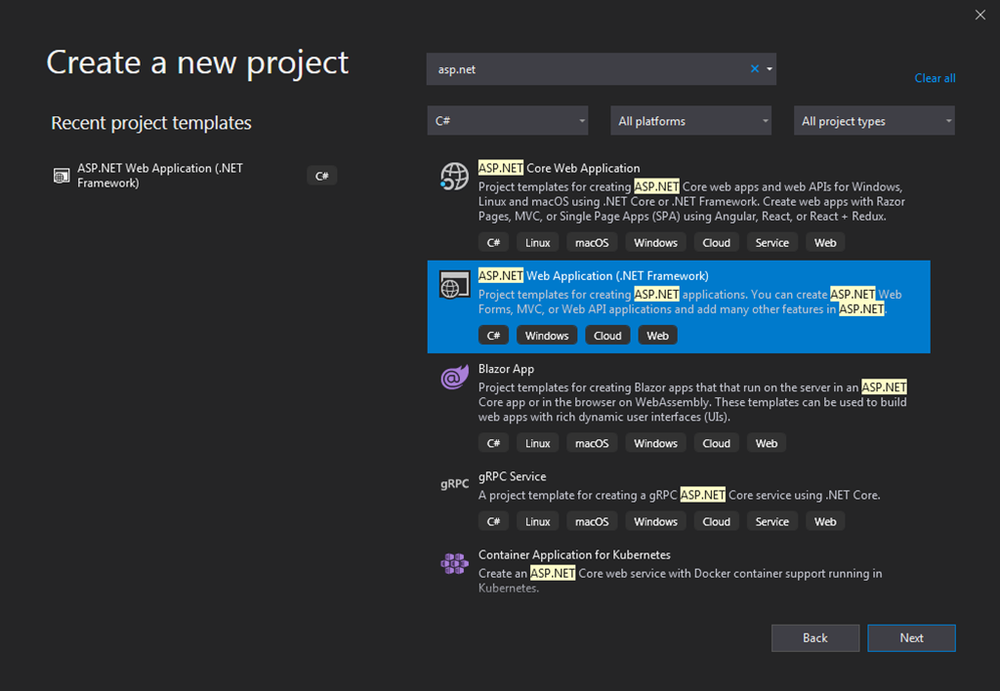
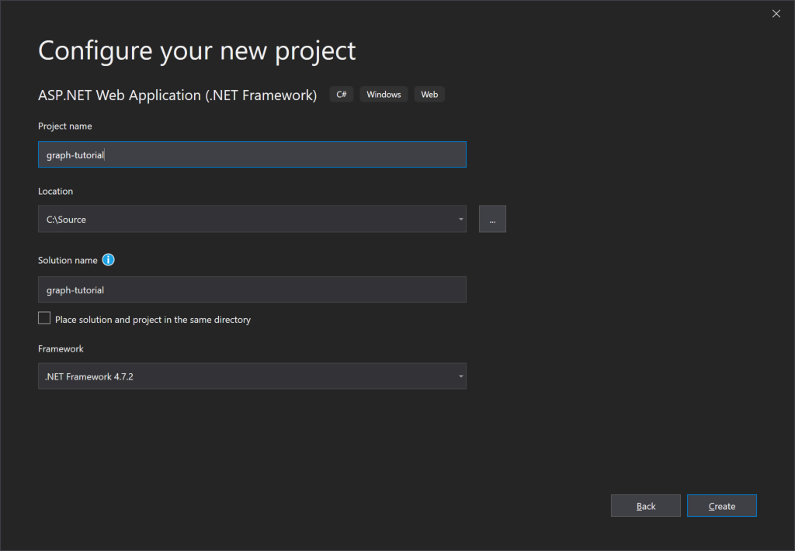
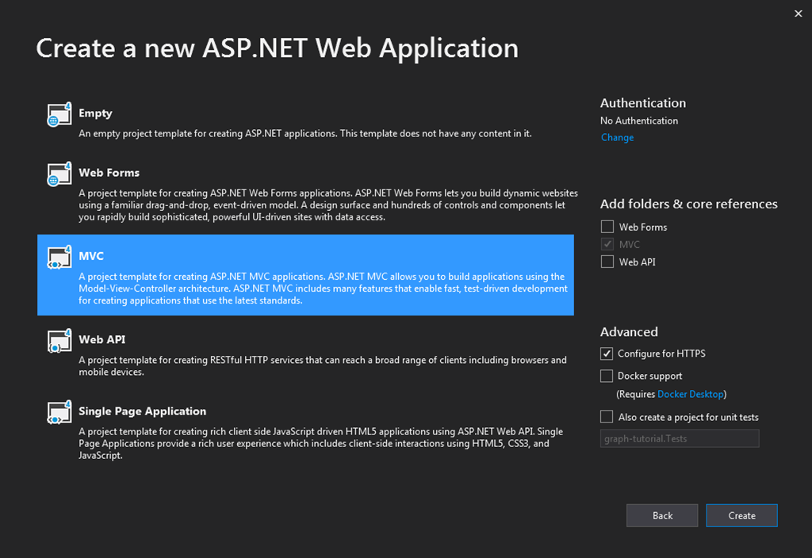

<!-- markdownlint-disable MD002 MD041 -->

<span data-ttu-id="dd28a-101">Comece criando um projeto MVC do ASP.NET.</span><span class="sxs-lookup"><span data-stu-id="dd28a-101">Start by creating an ASP.NET MVC project.</span></span>

1. <span data-ttu-id="dd28a-102">Abra o Visual Studio e selecione **criar um novo projeto**.</span><span class="sxs-lookup"><span data-stu-id="dd28a-102">Open Visual Studio, and select **Create a new project**.</span></span>

1. <span data-ttu-id="dd28a-103">Na caixa de diálogo **criar novo projeto** , escolha a opção **aplicativo Web do ASP.net (.NET Framework)** que usa C# e, em seguida, selecione **Avançar**.</span><span class="sxs-lookup"><span data-stu-id="dd28a-103">In the **Create new project** dialog, choose the **ASP.NET Web Application (.NET Framework)** option that uses C#, then select **Next**.</span></span>

    

1. <span data-ttu-id="dd28a-105">Insira `graph-tutorial` o campo **nome do projeto** e selecione **criar**.</span><span class="sxs-lookup"><span data-stu-id="dd28a-105">Enter `graph-tutorial` in the **Project name** field and select **Create**.</span></span>

    

    > [!NOTE]
    > <span data-ttu-id="dd28a-107">Certifique-se de inserir exatamente o mesmo nome para o projeto do Visual Studio especificado nas instruções do laboratório.</span><span class="sxs-lookup"><span data-stu-id="dd28a-107">Ensure that you enter the exact same name for the Visual Studio Project that is specified in these lab instructions.</span></span> <span data-ttu-id="dd28a-108">O nome do projeto do Visual Studio se torna parte do namespace no código.</span><span class="sxs-lookup"><span data-stu-id="dd28a-108">The Visual Studio Project name becomes part of the namespace in the code.</span></span> <span data-ttu-id="dd28a-109">O código dentro dessas instruções depende do namespace correspondente ao nome do projeto do Visual Studio especificado nessas instruções.</span><span class="sxs-lookup"><span data-stu-id="dd28a-109">The code inside these instructions depends on the namespace matching the Visual Studio Project name specified in these instructions.</span></span> <span data-ttu-id="dd28a-110">Se você usar um nome de projeto diferente, o código não será compilado, a menos que você ajuste todos os namespaces para corresponder ao nome do projeto do Visual Studio que você digitou ao criar o projeto.</span><span class="sxs-lookup"><span data-stu-id="dd28a-110">If you use a different project name the code will not compile unless you adjust all the namespaces to match the Visual Studio Project name you enter when you create the project.</span></span>

1. <span data-ttu-id="dd28a-111">Escolha **MVC** e selecione **criar**.</span><span class="sxs-lookup"><span data-stu-id="dd28a-111">Choose **MVC** and select **Create**.</span></span>

    

1. <span data-ttu-id="dd28a-113">Pressione **F5** ou selecione **debug > iniciar a depuração**.</span><span class="sxs-lookup"><span data-stu-id="dd28a-113">Press **F5** or select **Debug > Start Debugging**.</span></span> <span data-ttu-id="dd28a-114">Se tudo estiver funcionando, seu navegador padrão deverá abrir e exibir uma página padrão do ASP.NET.</span><span class="sxs-lookup"><span data-stu-id="dd28a-114">If everything is working, your default browser should open and display a default ASP.NET page.</span></span>

## <a name="add-nuget-packages"></a><span data-ttu-id="dd28a-115">Adicionar pacotes NuGet</span><span class="sxs-lookup"><span data-stu-id="dd28a-115">Add NuGet packages</span></span>

<span data-ttu-id="dd28a-116">Antes de prosseguir, atualize o `bootstrap` pacote NuGet e instale alguns pacotes NuGet adicionais que você usará posteriormente.</span><span class="sxs-lookup"><span data-stu-id="dd28a-116">Before moving on, update the `bootstrap` NuGet package, and install some additional NuGet packages that you will use later.</span></span>

- <span data-ttu-id="dd28a-117">[Microsoft. Owin. host. SystemWeb](https://www.nuget.org/packages/Microsoft.Owin.Host.SystemWeb/) para habilitar as interfaces do [Owin](http://owin.org/) no aplicativo ASP.net.</span><span class="sxs-lookup"><span data-stu-id="dd28a-117">[Microsoft.Owin.Host.SystemWeb](https://www.nuget.org/packages/Microsoft.Owin.Host.SystemWeb/) to enable the [OWIN](http://owin.org/) interfaces in the ASP.NET application.</span></span>
- <span data-ttu-id="dd28a-118">[Microsoft. Owin. Security. OpenIdConnect](https://www.nuget.org/packages/Microsoft.Owin.Security.OpenIdConnect/) para fazer a Autenticação OpenID Connect com o Azure.</span><span class="sxs-lookup"><span data-stu-id="dd28a-118">[Microsoft.Owin.Security.OpenIdConnect](https://www.nuget.org/packages/Microsoft.Owin.Security.OpenIdConnect/) for doing OpenID Connect authentication with Azure.</span></span>
- <span data-ttu-id="dd28a-119">[Microsoft. Owin. Security. cookies](https://www.nuget.org/packages/Microsoft.Owin.Security.Cookies/) para habilitar a autenticação baseada em cookies.</span><span class="sxs-lookup"><span data-stu-id="dd28a-119">[Microsoft.Owin.Security.Cookies](https://www.nuget.org/packages/Microsoft.Owin.Security.Cookies/) to enable cookie-based authentication.</span></span>
- <span data-ttu-id="dd28a-120">[Microsoft. Identity. Client](https://www.nuget.org/packages/Microsoft.Identity.Client/) para solicitar e gerenciar tokens de acesso.</span><span class="sxs-lookup"><span data-stu-id="dd28a-120">[Microsoft.Identity.Client](https://www.nuget.org/packages/Microsoft.Identity.Client/) for requesting and managing access tokens.</span></span>
- <span data-ttu-id="dd28a-121">[Microsoft. Graph](https://www.nuget.org/packages/Microsoft.Graph/) para fazer chamadas para o Microsoft Graph.</span><span class="sxs-lookup"><span data-stu-id="dd28a-121">[Microsoft.Graph](https://www.nuget.org/packages/Microsoft.Graph/) for making calls to Microsoft Graph.</span></span>

1. <span data-ttu-id="dd28a-122">Selecione **ferramentas > Gerenciador de pacotes do NuGet > console do Gerenciador de pacotes**.</span><span class="sxs-lookup"><span data-stu-id="dd28a-122">Select **Tools > NuGet Package Manager > Package Manager Console**.</span></span>
1. <span data-ttu-id="dd28a-123">No console do Gerenciador de pacotes, insira os seguintes comandos.</span><span class="sxs-lookup"><span data-stu-id="dd28a-123">In the Package Manager Console, enter the following commands.</span></span>

    ```Powershell
    Update-Package bootstrap
    Install-Package Microsoft.Owin.Host.SystemWeb
    Install-Package Microsoft.Owin.Security.OpenIdConnect
    Install-Package Microsoft.Owin.Security.Cookies
    Install-Package Microsoft.Identity.Client -Version 4.0.0
    Install-Package Microsoft.Graph -Version 1.15.0
    ```

## <a name="design-the-app"></a><span data-ttu-id="dd28a-124">Projetar o aplicativo</span><span class="sxs-lookup"><span data-stu-id="dd28a-124">Design the app</span></span>

<span data-ttu-id="dd28a-125">Nesta seção, você criará a estrutura básica do aplicativo.</span><span class="sxs-lookup"><span data-stu-id="dd28a-125">In this section you will create the basic structure of the application.</span></span>

1. <span data-ttu-id="dd28a-126">Crie uma classe de inicialização OWIN básica.</span><span class="sxs-lookup"><span data-stu-id="dd28a-126">Create a basic OWIN startup class.</span></span> <span data-ttu-id="dd28a-127">Clique com o botão `graph-tutorial` direito do mouse na pasta no Gerenciador de soluções e selecione **Adicionar > novo item**.</span><span class="sxs-lookup"><span data-stu-id="dd28a-127">Right-click the `graph-tutorial` folder in Solution Explorer and select **Add > New Item**.</span></span> <span data-ttu-id="dd28a-128">Escolha o modelo de **classe de inicialização OWIN** , nomeie `Startup.cs`o arquivo e selecione **Adicionar**.</span><span class="sxs-lookup"><span data-stu-id="dd28a-128">Choose the **OWIN Startup Class** template, name the file `Startup.cs`, and select **Add**.</span></span>

1. <span data-ttu-id="dd28a-129">Clique com o botão direito do mouse na pasta **modelos** no Gerenciador de soluções e selecione **Adicionar > classe...**. Nomeie a classe `Alert` e selecione **Adicionar**.</span><span class="sxs-lookup"><span data-stu-id="dd28a-129">Right-click the **Models** folder in Solution Explorer and select **Add > Class...**. Name the class `Alert` and select **Add**.</span></span> <span data-ttu-id="dd28a-130">Substitua todo o conteúdo do `Alert.cs` pelo código a seguir.</span><span class="sxs-lookup"><span data-stu-id="dd28a-130">Replace the entire contents of `Alert.cs` with the following code.</span></span>

    ```cs
    namespace graph_tutorial.Models
    {
        // Used to flash error messages in the app's views.
        public class Alert
        {
            public const string AlertKey = "TempDataAlerts";
            public string Message { get; set; }
            public string Debug { get; set; }
        }
    }
    ```

1. <span data-ttu-id="dd28a-131">Abra o `./Views/Shared/_Layout.cshtml` arquivo e substitua todo o conteúdo pelo código a seguir para atualizar o layout global do aplicativo.</span><span class="sxs-lookup"><span data-stu-id="dd28a-131">Open the `./Views/Shared/_Layout.cshtml` file, and replace its entire contents with the following code to update the global layout of the app.</span></span>

    ```html
    @{
        var alerts = TempData.ContainsKey(graph_tutorial.Models.Alert.AlertKey) ?
            (List<graph_tutorial.Models.Alert>)TempData[graph_tutorial.Models.Alert.AlertKey] :
            new List<graph_tutorial.Models.Alert>();
    }

    <!DOCTYPE html>
    <html>
    <head>
        <meta charset="utf-8" />
        <meta name="viewport" content="width=device-width, initial-scale=1.0">
        <title>ASP.NET Graph Tutorial</title>
        @Styles.Render("~/Content/css")
        @Scripts.Render("~/bundles/modernizr")

        <link rel="stylesheet" href="https://use.fontawesome.com/releases/v5.1.0/css/all.css"
              integrity="sha384-lKuwvrZot6UHsBSfcMvOkWwlCMgc0TaWr+30HWe3a4ltaBwTZhyTEggF5tJv8tbt"
              crossorigin="anonymous">
    </head>

    <body>
        <nav class="navbar navbar-expand-md navbar-dark fixed-top bg-dark">
            <div class="container">
                @Html.ActionLink("ASP.NET Graph Tutorial", "Index", "Home", new { area = "" }, new { @class = "navbar-brand" })
                <button class="navbar-toggler" type="button" data-toggle="collapse" data-target="#navbarCollapse"
                        aria-controls="navbarCollapse" aria-expanded="false" aria-label="Toggle navigation">
                    <span class="navbar-toggler-icon"></span>
                </button>
                <div class="collapse navbar-collapse" id="navbarCollapse">
                    <ul class="navbar-nav mr-auto">
                        <li class="nav-item">
                            @Html.ActionLink("Home", "Index", "Home", new { area = "" },
                                new { @class = ViewBag.Current == "Home" ? "nav-link active" : "nav-link" })
                        </li>
                        @if (Request.IsAuthenticated)
                        {
                            <li class="nav-item" data-turbolinks="false">
                                @Html.ActionLink("Calendar", "Index", "Calendar", new { area = "" },
                                    new { @class = ViewBag.Current == "Calendar" ? "nav-link active" : "nav-link" })
                            </li>
                        }
                    </ul>
                    <ul class="navbar-nav justify-content-end">
                        <li class="nav-item">
                            <a class="nav-link" href="https://developer.microsoft.com/graph/docs/concepts/overview" target="_blank">
                                <i class="fas fa-external-link-alt mr-1"></i>Docs
                            </a>
                        </li>
                        @if (Request.IsAuthenticated)
                        {
                            <li class="nav-item dropdown">
                                <a class="nav-link dropdown-toggle" data-toggle="dropdown" href="#" role="button" aria-haspopup="true" aria-expanded="false">
                                    @if (!string.IsNullOrEmpty(ViewBag.User.Avatar))
                                    {
                                        
                                    }
                                    else
                                    {
                                        <i class="far fa-user-circle fa-lg rounded-circle align-self-center mr-2" style="width: 32px;"></i>
                                    }
                                </a>
                                <div class="dropdown-menu dropdown-menu-right">
                                    <h5 class="dropdown-item-text mb-0">@ViewBag.User.DisplayName</h5>
                                    <p class="dropdown-item-text text-muted mb-0">@ViewBag.User.Email</p>
                                    <div class="dropdown-divider"></div>
                                    @Html.ActionLink("Sign Out", "SignOut", "Account", new { area = "" }, new { @class = "dropdown-item" })
                                </div>
                            </li>
                        }
                        else
                        {
                            <li class="nav-item">
                                @Html.ActionLink("Sign In", "SignIn", "Account", new { area = "" }, new { @class = "nav-link" })
                            </li>
                        }
                    </ul>
                </div>
            </div>
        </nav>
        <main role="main" class="container">
            @foreach (var alert in alerts)
            {
                <div class="alert alert-danger" role="alert">
                    <p class="mb-3">@alert.Message</p>
                    @if (!string.IsNullOrEmpty(alert.Debug))
                    {
                        <pre class="alert-pre border bg-light p-2"><code>@alert.Debug</code></pre>
                    }
                </div>
            }

            @RenderBody()
        </main>
        @Scripts.Render("~/bundles/jquery")
        @Scripts.Render("~/bundles/bootstrap")
        @RenderSection("scripts", required: false)
    </body>
    </html>
    ```

    > [!NOTE]
    > <span data-ttu-id="dd28a-132">Este código adiciona a [inicialização](https://getbootstrap.com/) para estilos simples e a [fonte incrível](https://fontawesome.com/) para alguns ícones simples.</span><span class="sxs-lookup"><span data-stu-id="dd28a-132">This code adds [Bootstrap](https://getbootstrap.com/) for simple styling, and [Font Awesome](https://fontawesome.com/) for some simple icons.</span></span> <span data-ttu-id="dd28a-133">Também define um layout global com uma barra de navegação e usa a `Alert` classe para exibir alertas.</span><span class="sxs-lookup"><span data-stu-id="dd28a-133">It also defines a global layout with a nav bar, and uses the `Alert` class to display any alerts.</span></span>

1. <span data-ttu-id="dd28a-134">Abra `Content/Site.css` e substitua todo o conteúdo pelo código a seguir.</span><span class="sxs-lookup"><span data-stu-id="dd28a-134">Open `Content/Site.css` and replace its entire contents with the following code.</span></span>

    ```css
    body {
      padding-top: 4.5rem;
    }

    .alert-pre {
      word-wrap: break-word;
      word-break: break-all;
      white-space: pre-wrap;
    }
    ```

1. <span data-ttu-id="dd28a-135">Abra o `Views/Home/index.cshtml` arquivo e substitua seu conteúdo pelo seguinte.</span><span class="sxs-lookup"><span data-stu-id="dd28a-135">Open the `Views/Home/index.cshtml` file and replace its contents with the following.</span></span>

    ```html
    @{
        ViewBag.Current = "Home";
    }

    <div class="jumbotron">
        <h1>ASP.NET Graph Tutorial</h1>
        <p class="lead">This sample app shows how to use the Microsoft Graph API to access Outlook and OneDrive data from ASP.NET</p>
        @if (Request.IsAuthenticated)
        {
            <h4>Welcome @ViewBag.User.DisplayName!</h4>
            <p>Use the navigation bar at the top of the page to get started.</p>
        }
        else
        {
            @Html.ActionLink("Click here to sign in", "SignIn", "Account", new { area = "" }, new { @class = "btn btn-primary btn-large" })
        }
    </div>
    ```

1. <span data-ttu-id="dd28a-136">Clique com o botão direito do mouse na pasta **controladores** no Gerenciador de soluções e selecione **Adicionar > controlador...**. Escolha **controlador MVC 5-vazio** e selecione **Adicionar**.</span><span class="sxs-lookup"><span data-stu-id="dd28a-136">Right-click the **Controllers** folder in Solution Explorer and select **Add > Controller...**. Choose **MVC 5 Controller - Empty** and select **Add**.</span></span> <span data-ttu-id="dd28a-137">Nomeie o controlador `BaseController` e selecione **Adicionar**.</span><span class="sxs-lookup"><span data-stu-id="dd28a-137">Name the controller `BaseController` and select **Add**.</span></span> <span data-ttu-id="dd28a-138">Substitua o conteúdo do `BaseController.cs` pelo código a seguir.</span><span class="sxs-lookup"><span data-stu-id="dd28a-138">Replace the contents of `BaseController.cs` with the following code.</span></span>

    ```cs
    using graph_tutorial.Models;
    using System.Collections.Generic;
    using System.Web.Mvc;

    namespace graph_tutorial.Controllers
    {
        public abstract class BaseController : Controller
        {
            protected void Flash(string message, string debug=null)
            {
                var alerts = TempData.ContainsKey(Alert.AlertKey) ?
                    (List<Alert>)TempData[Alert.AlertKey] :
                    new List<Alert>();

                alerts.Add(new Alert
                {
                    Message = message,
                    Debug = debug
                });

                TempData[Alert.AlertKey] = alerts;
            }
        }
    }
    ```

1. <span data-ttu-id="dd28a-139">Abra `Controllers/HomeController.cs` e altere a `public class HomeController : Controller` linha para:</span><span class="sxs-lookup"><span data-stu-id="dd28a-139">Open `Controllers/HomeController.cs` and change the `public class HomeController : Controller` line to:</span></span>

    ```cs
    public class HomeController : BaseController
    ```

1. <span data-ttu-id="dd28a-140">Salve todas as suas alterações e reinicie o servidor.</span><span class="sxs-lookup"><span data-stu-id="dd28a-140">Save all of your changes and restart the server.</span></span> <span data-ttu-id="dd28a-141">Agora, o aplicativo deve ser muito diferente.</span><span class="sxs-lookup"><span data-stu-id="dd28a-141">Now, the app should look very different.</span></span>

    
