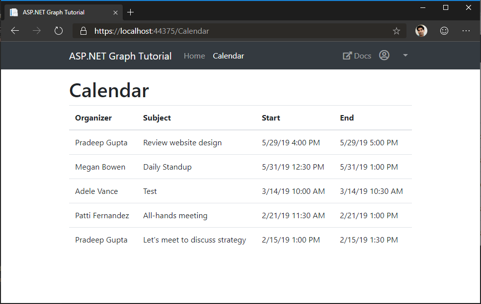

<!-- markdownlint-disable MD002 MD041 -->

Nesta demonstração, você incorporará o Microsoft Graph no aplicativo. Para este aplicativo, você usará a [biblioteca de cliente do Microsoft Graph para .net](https://github.com/microsoftgraph/msgraph-sdk-dotnet) para fazer chamadas para o Microsoft Graph.

## <a name="get-calendar-events-from-outlook"></a>Obter eventos de calendário do Outlook

Comece estendendo `GraphHelper` a classe criada no último módulo. Primeiro, adicione as seguintes `using` instruções à parte superior do `Helpers/GraphHelper.cs` arquivo.

```cs
using graph_tutorial.TokenStorage;
using Microsoft.Identity.Client;
using System.Collections.Generic;
using System.Configuration;
using System.Linq;
using System.Security.Claims;
using System.Web;
```

Em seguida, adicione o código a `GraphHelper` seguir à classe.

```cs
// Load configuration settings from PrivateSettings.config
private static string appId = ConfigurationManager.AppSettings["ida:AppId"];
private static string appSecret = ConfigurationManager.AppSettings["ida:AppSecret"];
private static string redirectUri = ConfigurationManager.AppSettings["ida:RedirectUri"];
private static string graphScopes = ConfigurationManager.AppSettings["ida:AppScopes"];

public static async Task<IEnumerable<Event>> GetEventsAsync()
{
    var graphClient = GetAuthenticatedClient();

    var events = await graphClient.Me.Events.Request()
        .Select("subject,organizer,start,end")
        .OrderBy("createdDateTime DESC")
        .GetAsync();

    return events.CurrentPage;
}

private static GraphServiceClient GetAuthenticatedClient()
{
    return new GraphServiceClient(
        new DelegateAuthenticationProvider(
            async (requestMessage) =>
            {
                // Get the signed in user's id and create a token cache
                string signedInUserId = ClaimsPrincipal.Current.FindFirst(ClaimTypes.NameIdentifier).Value;
                SessionTokenStore tokenStore = new SessionTokenStore(signedInUserId,
                    new HttpContextWrapper(HttpContext.Current));

                var idClient = new ConfidentialClientApplication(
                    appId, redirectUri, new ClientCredential(appSecret),
                    tokenStore.GetMsalCacheInstance(), null);

                var accounts = await idClient.GetAccountsAsync();

                // By calling this here, the token can be refreshed
                // if it's expired right before the Graph call is made
                var result = await idClient.AcquireTokenSilentAsync(
                    graphScopes.Split(' '), accounts.FirstOrDefault());

                requestMessage.Headers.Authorization =
                    new AuthenticationHeaderValue("Bearer", result.AccessToken);
            }));
}
```

Considere o que esse código está fazendo.

- A `GetAuthenticatedClient` função inicializa a `GraphServiceClient` com um provedor de autenticação que `AcquireTokenSilentAsync`chama.
- Na `GetEventsAsync` função:
  - A URL que será chamada é `/v1.0/me/events`.
  - A `Select` função limita os campos retornados para cada evento para apenas aqueles que o modo de exibição realmente usará.
  - A `OrderBy` função classifica os resultados pela data e hora em que foram criados, com o item mais recente em primeiro lugar.

Agora, crie um controlador para os modos de exibição de calendário. Clique com o botão direito do mouse na pasta **controladores** no Gerenciador de soluções e escolha **Adicionar controlador de >..**.. Escolha **controlador MVC 5-vazio** e escolha **Adicionar**. Nomeie o controlador `CalendarController` e escolha **Adicionar**. Substitua todo o conteúdo do novo arquivo pelo código a seguir.

```cs
using graph_tutorial.Helpers;
using System.Threading.Tasks;
using System.Web.Mvc;

namespace graph_tutorial.Controllers
{
    public class CalendarController : BaseController
    {
        // GET: Calendar
        [Authorize]
        public async Task<ActionResult> Index()
        {
            var events = await GraphHelper.GetEventsAsync();
            return Json(events, JsonRequestBehavior.AllowGet);
        }
    }
}
```

Agora você pode testar isso. Inicie o aplicativo, entre e clique no link **calendário** na barra de navegação. Se tudo funcionar, você deverá ver um despejo JSON de eventos no calendário do usuário.

## <a name="display-the-results"></a>Exibir os resultados

Agora você pode adicionar um modo de exibição para exibir os resultados de forma mais amigável. No Solution Explorer, clique com o botão direito do mouse na pasta **views/Calendar** e escolha **Add > View...**. Nomeie o modo `Index` de exibição e escolha **Adicionar**. Substitua todo o conteúdo do novo arquivo pelo código a seguir.

```html
@model IEnumerable<Microsoft.Graph.Event>

@{
    ViewBag.Current = "Calendar";
}

<h1>Calendar</h1>
<table class="table">
    <thead>
        <tr>
            <th scope="col">Organizer</th>
            <th scope="col">Subject</th>
            <th scope="col">Start</th>
            <th scope="col">End</th>
        </tr>
    </thead>
    <tbody>
        @foreach (var item in Model)
        {
            <tr>
                <td>@item.Organizer.EmailAddress.Name</td>
                <td>@item.Subject</td>
                <td>@Convert.ToDateTime(item.Start.DateTime).ToString("M/d/yy h:mm tt")</td>
                <td>@Convert.ToDateTime(item.End.DateTime).ToString("M/d/yy h:mm tt")</td>
            </tr>
        }
    </tbody>
</table>
```

Isso executará um loop através de uma coleção de eventos e adicionará uma linha de tabela para cada um. Remova a `return Json(events, JsonRequestBehavior.AllowGet);` linha da `Index` função no `Controllers/CalendarController.cs`e substitua-a pelo código a seguir.

```cs
return View(events);
```

Inicie o aplicativo, entre e clique no link do **calendário** . O aplicativo agora deve renderizar uma tabela de eventos.

