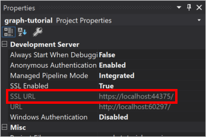
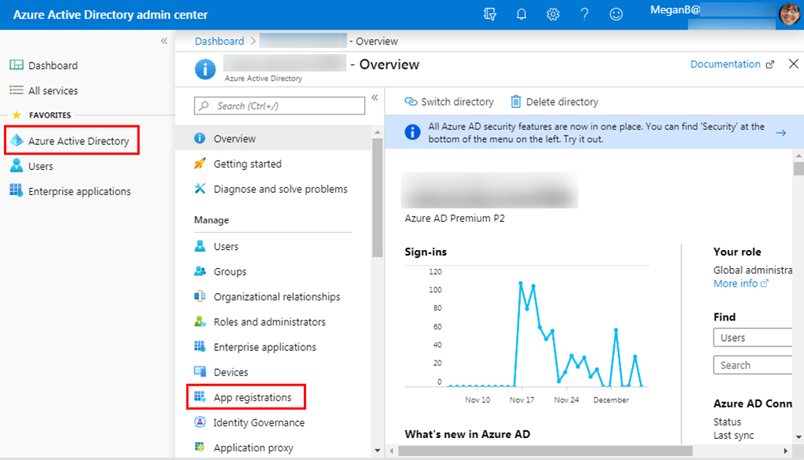

<!-- markdownlint-disable MD002 MD041 -->

Neste exercício, você criará um novo registro de aplicativo Web do Azure AD usando o centro de administração do Azure Active Directory.In this exercise, you will create a new Azure AD web application registration using the Azure Active Directory admin center.

1. Determine a URL do seu aplicativo do ASP.NET.Determine your ASP.NET app's URL. No Gerenciador de soluções do Visual Studio, selecione o projeto do **tutorial de gráfico** .In Visual Studio's Solution Explorer, select the **graph-tutorial** project. Na janela **Propriedades** , localize o valor da **URL**.In the **Properties** window, find the value of **URL**. Copie esse valor.Copy this value.

    

1. Abra um navegador e navegue até o [centro de administração do Azure Active Directory](https://aad.portal.azure.com).Open a browser and navigate to the [Azure Active Directory admin center](https://aad.portal.azure.com). Faça logon usando uma **conta pessoal** (aka: conta da Microsoft) ou **conta corporativa ou de estudante**.Login using a **personal account** (aka: Microsoft Account) or **Work or School Account**.

1. Selecione **Azure Active Directory** na navegação à esquerda e, em seguida, selecione **registros de aplicativo (visualização)** em **gerenciar**.Select **Azure Active Directory** in the left-hand navigation, then select **App registrations (Preview)** under **Manage**.

    

1. Selecione **novo registro**.Select **New registration**. Na página **registrar um aplicativo** , defina os valores da seguinte maneira.On the **Register an application** page, set the values as follows.

    - Defina \*\*\*\* o nome `ASP.NET Graph Tutorial`como.Set **Name** to `ASP.NET Graph Tutorial`.
    - Defina os **tipos de conta com suporte** para **contas em qualquer diretório organizacional e contas pessoais da Microsoft**.Set **Supported account types** to **Accounts in any organizational directory and personal Microsoft accounts**.
    - Em **URI**de redirecionamento, defina o primeiro menu `Web` suspenso como e defina o valor para a URL do aplicativo ASP.NET que você copiou na etapa 1.Under **Redirect URI**, set the first drop-down to `Web` and set the value to the ASP.NET app URL you copied in step 1.

    

1. Escolha **registrar**.Choose **Register**. Na página do **Tutorial ASP.net Graph** , copie o valor da **ID do aplicativo (cliente)** e salve-o, você precisará dele na próxima etapa.On the **ASP.NET Graph Tutorial** page, copy the value of the **Application (client) ID** and save it, you will need it in the next step.

    

1. Selecione **autenticação** em **gerenciar**.Select **Authentication** under **Manage**. Localize a seção **Grant implícita** e habilite os tokens de **ID**.Locate the **Implicit grant** section and enable **ID tokens**. Selecione **Salvar**.Choose **Save**.

    

1. Selecione **certificados & segredos** sob **gerenciar**.Select **Certificates & secrets** under **Manage**. Selecione o botão **novo cliente secreto** .Select the **New client secret** button. Insira um valor em **Descrição** e selecione uma das opções para **expirar** e escolha **Adicionar**.Enter a value in **Description** and select one of the options for **Expires** and choose **Add**.

    

1. Copie o valor de segredo do cliente antes de sair desta página.Copy the client secret value before you leave this page. Você precisará dela na próxima etapa.You will need it in the next step.

    > [!IMPORTANT]
    > Esse segredo do cliente nunca é mostrado novamente, portanto, certifique-se de copiá-lo agora.This client secret is never shown again, so make sure you copy it now.

    